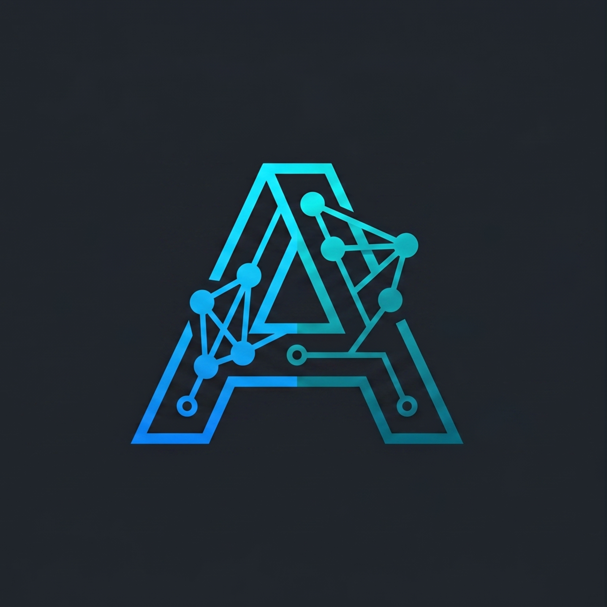

  
  <h1>
    
  </h1>
   
  

  
  
  

---

I specialize in bridging the gap between rigorous academic theory and real-world product development. Currently, I combine my research in cognitive sciences with building scalable Backend, Data Engineering, and Machine Learning solutions.

### Technical Focus

*   **Artificial Intelligence:** Design, training, and evaluation of deep architectures (CNNs, LSTMs, Transformers) and Generative AI.
*   **Data Engineering:** Big data processing, distributed systems, and structured/unstructured databases handling.
*   **Backend Development:** API creation, microservices orchestration, AI model deployment in production, and agile automation.

### Tech Stack

#### AI & Data Science

  
  
  
  

#### Big Data & Engineering

  
  
  

#### Languages & Development

  
  
  

#### DevOps & Tools

  
  
  

### Projects

1.  **[[WhatsApp AI Agent Repo]](https://github.com/lctr33/cerealwleche)**: AI agent for sales automation orchestrated with Docker and microservices.
2.  **[[Relative-Museformer Repo]](https://github.com/lctr33/Classy)**: *Relative-Museformer*, implementation of a hybrid Transformer architecture for symbolic music generation.
3.  **[[Recommendation System]](https://github.com/lctr33/Sistema-de-recomendacion)**: System for recommending books from Amazon data using matrix multiplication.

### 📫 Let's Connect

I am open to remote freelance opportunities, research collaborations, and software development projects.

*   **Email:** anibalmeca8@gmail.com

<!--
**lctr33/lctr33** is a ✨ _special_ ✨ repository because its `README.md` (this file) appears on your GitHub profile.

Here are some ideas to get you started:

- 🔭 I’m currently working on ...
- 🌱 I’m currently learning ...
- 👯 I’m looking to collaborate on ...
- 🤔 I’m looking for help with ...
- 💬 Ask me about ...
- 📫 How to reach me: ...
- 😄 Pronouns: ...
- ⚡ Fun fact: ...
-->
